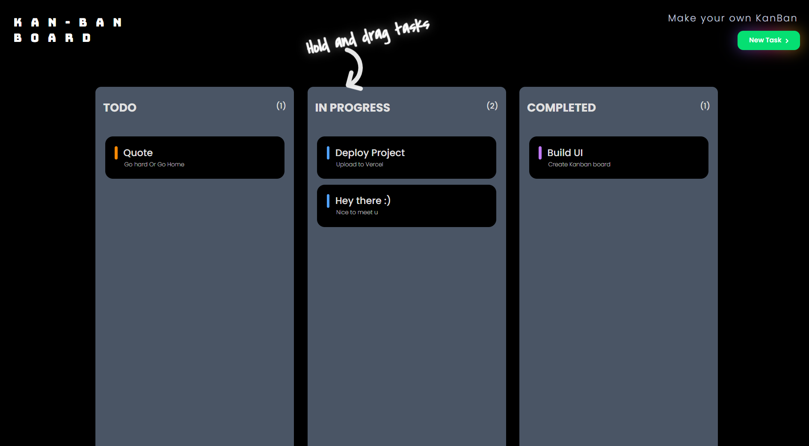
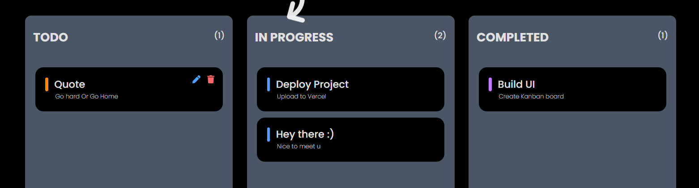

## KanBan Board

A clean and minimal Kanban board built using React and dnd-kit.

I built this project mainly to practice my React concepts, understand how drag-and-drop systems work internally, and experiment with building modern frontend UI designs. I also wanted to create something that I can actually use for managing daily tasks.

## Features
Drag and drop tasks between sections
Create, edit, and delete tasks
LocalStorage persistence
Responsive layout
Smooth UI animations
Interactive onboarding hint

## Tech Stack
React
Tailwind CSS
dnd-kit
Vite